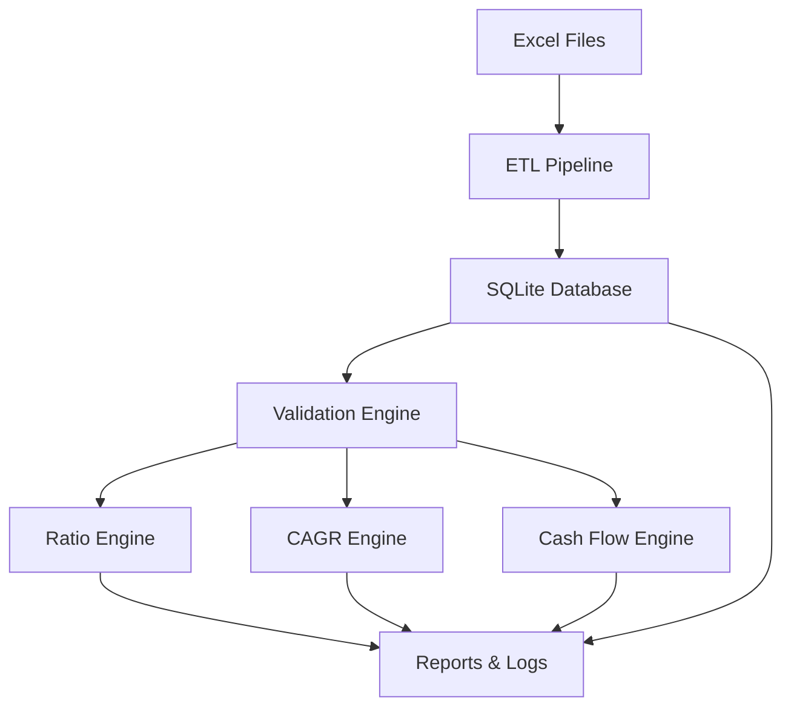

# N100 Financial Intelligence Platform


---

## 🚀 Project Overview

**N100 Financial Intelligence Platform** is a world-class, end-to-end financial analytics repository built with Python and SQLite. It processes historical financial statement data for Nifty 100 companies and computes over **50 investment-grade KPIs** for analysis, validation, and reporting.

This repository is designed for:
- analysts who want fast financial computation
- data engineers building reliable ETL
- investors validating company performance
- recruiters looking for high-quality engineering work
- open-source contributors who want a polished platform

---

## 🌟 Key Highlights

- ✅ End-to-end ETL pipeline for financial statement ingestion
- ✅ SQLite-backed analytics database
- ✅ Comprehensive validation engine for financial data
- ✅ 50+ KPIs computed across profitability, leverage, CAGR, and cash flow
- ✅ Automated report generation for analytics and edge cases
- ✅ 36 unit tests validating business logic and integrity
- ✅ Clean project structure optimized for maintainability
- ✅ Recruiter-friendly documentation and architecture

---

## 📌 Table of Contents

- [Project Overview](#project-overview)
- [Highlights](#key-highlights)
- [Tech Stack](#tech-stack)
- [Features](#project-features)
- [Architecture](#project-architecture)
- [Database](#database)
- [KPIs Implemented](#kpis-implemented)
- [Reports Generated](#reports-generated)
- [Project Structure](#project-structure)
- [Installation](#installation)
- [Usage](#usage)
- [Screenshots](#screenshots)
- [Financial Concepts](#financial-concepts)
- [Performance](#performance)
- [Testing](#testing)
- [Future Improvements](#future-improvements)
- [Author](#author)
- [License](#license)
- [Acknowledgements](#acknowledgements)

---

## 🧠 Tech Stack

| Layer | Technology |
|---|---|
| Core Language | Python |
| Data Processing | Pandas, NumPy |
| Database | SQLite |
| Reports | OpenPyXL, Matplotlib |
| Testing | PyTest |
| Version Control | Git, GitHub |

---

## ✅ Project Features

- **ETL Pipeline**
- **SQLite Database**
- **Financial Statement Validation**
- **Duplicate Detection**
- **Balance Sheet Validation**
- **Income Statement Validation**
- **Cash Flow Validation**
- **Profitability Ratio Engine**
- **Leverage Ratio Engine**
- **CAGR Engine**
- **Cash Flow KPI Engine**
- **Database Population**
- **Automated Reports**
- **36 Unit Tests**

---

## 🏗️ Project Architecture



---

## 🗄️ Database

**SQLite** is used as the persistent analytics store. Data tables are designed for reliability and historical accuracy.

### Main Tables

| Table | Purpose |
|---|---|
| `companies` | Company master list |
| `profitandloss` | Income statement history |
| `balancesheet` | Balance sheet history |
| `cashflow` | Cash flow statement history |
| `analysis` | Derived analytics |
| `documents` | Documentation metadata |
| `prosandcons` | Qualitative analysis |
| `financial_ratios` | Computed KPI repository |
| `market_cap` | Market capitalization data |
| `peer_groups` | Peer segmentation data |
| `sectors` | Sector classification |
| `stock_prices` | Historical share prices |

---

## 📈 KPIs Implemented

These KPIs are core to investment quality screening and company performance analysis.

| Category | KPI |
|---|---|
| Profitability | Net Profit Margin |
|  | Operating Profit Margin |
|  | Return on Equity (ROE) |
|  | Return on Assets (ROA) |
|  | Return on Capital Employed (ROCE) |
| Leverage | Debt to Equity |
|  | Interest Coverage |
|  | Asset Turnover |
|  | Net Debt |
| CAGR | Revenue CAGR |
|  | PAT CAGR |
|  | EPS CAGR |
| Cash Flow | Free Cash Flow |
|  | FCF Conversion |
|  | CapEx Intensity |
|  | CFO Quality Score |
|  | Composite Quality Score |

---

## 📝 Reports Generated

Output reports are saved in the `reports/` directory.

- `profitability_ratios.csv`
- `day09_ratio_engine.csv`
- `revenue_cagr.csv`
- `capital_allocation.csv`
- `database_population_report.md`
- `ratio_edge_cases.log`
- `validation_summary.md`
- `edge_case_summary.md`

---

## 📁 Project Structure

```text
N100-Financial-Intelligence/
├── README.md
├── LICENSE
├── requirements.txt
├── database/
│   └── n100.db
├── docs/
│   ├── sprint1/
│   └── sprint2/
├── notebooks/
│   ├── sprint1_data_cleaning.ipynb
│   ├── sprint1_data_loading.ipynb
│   └── sprint2_analysis.ipynb
├── reports/
│   ├── capital_allocation.csv
│   ├── cagr_edge_cases.csv
│   ├── database_population_report.md
│   ├── edge_case_summary.md
│   ├── final_validation_report.md
│   ├── profitability_ratios.csv
│   └── ratio_edge_cases.log
├── scripts/
├── src/
│   ├── analytics/
│   │   ├── cagr_engine.py
│   │   ├── cashflow_engine.py
│   │   ├── cashflow_kpis.py
│   │   ├── populate_financial_ratios.py
│   │   ├── ratio_engine.py
│   │   └── edge_cases.py
│   ├── config/
│   │   └── etl/
│   ├── etl/
│   ├── kpi_engine/
│   │   └── profitability.py
│   └── utils/
└── tests/
    ├── test_cagr.py
    ├── test_cashflow.py
    ├── test_leverage.py
    ├── test_ratios.py
    ├── test_population_workflow.py
    └── etl/
```

---

## 🧩 Installation

### Clone Repository

```bash
git clone https://github.com/Rvx0098/N100-Financial-Intelligence.git
cd N100-Financial-Intelligence
```

### Create Virtual Environment

```bash
python -m venv venv
```

### Activate Environment

#### Windows

```powershell
.\venv\Scripts\Activate.ps1
```

#### macOS / Linux

```bash
source venv/bin/activate
```

### Install Requirements

```bash
pip install -r requirements.txt
```

---

## ▶️ Usage

Use the following commands to run the core modules:

```bash
python src/etl/loader.py
python src/analytics/ratio_engine.py
python src/analytics/cagr_engine.py
python src/analytics/cashflow_engine.py
python src/analytics/populate_financial_ratios.py
pytest -q
```

---

## 🖥️ Screenshots

> Placeholder images for future visual documentation.

| Screenshot | Description |
|---|---|
|  | System architecture overview |
|  | SQLite database schema and tables |
|  | ROI and ratio engine output |
|  | Generated reports visualization |
|  | KPI charts and data views |
|  | Data exploration notebook |

---

## 📘 Financial Concepts

### Profitability Ratios

Profitability ratios help measure how efficiently a company converts revenue into net earnings:
- **Net Profit Margin** measures profit per unit of revenue
- **Operating Profit Margin** measures operating efficiency
- **Return on Equity** indicates shareholder returns

### Leverage Ratios

Leverage ratios show financial risk and borrowing efficiency:
- **Debt to Equity** reveals capital structure balance
- **Interest Coverage** tests the ability to service debt
- **Asset Turnover** measures revenue generated per asset

### Cash Flow KPIs

Cash flow KPIs show how cash is produced and used:
- **Free Cash Flow** is the cash remaining after capex
- **FCF Conversion** measures cash conversion efficiency
- **CapEx Intensity** checks how much revenue is spent on investments
- **CFO Quality Score** evaluates cash quality relative to profit

### CAGR Metrics

Compound Annual Growth Rates provide growth velocity:
- **Revenue CAGR**
- **PAT CAGR**
- **EPS CAGR**

---

## 📊 Performance

| Metric | Value |
|---|---|
| Companies covered | 92 |
| Financial records processed | 1200+ |
| KPIs calculated | 50+ |
| Unit tests | 36 |
| Data backend | SQLite |

This project is optimized for fast analytics on local machines using efficient pandas workflows and lightweight database storage.

---

## 🧪 Testing

The project includes a robust testing framework with **36 unit tests**.

### Run tests

```bash
pytest -q
```

### What is covered

- KPI calculations
- financial ratio formulas
- ETL data processing
- validation logic
- population workflow
- edge-case handling

---

## 🛠️ Validation

This platform includes comprehensive data validation:
- duplicate detection across financial records
- balance sheet consistency checks
- profit and loss validation
- cash flow verification
- database integrity checks

Every stage includes automated logging and report generation so analysts can trust the output.

---

## ⚡ Future Improvements

The roadmap includes modern enhancements to make the platform more powerful and interactive.

<details>
<summary>Future Roadmap</summary>

- **Interactive Dashboard** with filters and charts
- **REST API** for external analytics consumption
- **Portfolio Optimizer** for strategy simulation
- **Stock Screener** based on KPI thresholds
- **Machine Learning** for company ranking and anomaly detection
- **Forecasting** for future revenue, profit, and cash flow

</details>

---

## 🧭 Why This Project Matters

This repository is not just code — it is a bridge between financial data and actionable investment intelligence. It is built with reliability, maintainability, and expandability in mind. Recruiters and engineering managers will appreciate:
- strong Python engineering
- clear domain-driven design
- meaningful financial analysis
- reproducible data pipelines
- polished documentation and reports

---

## 👤 Author

**Rishit Verma**  
GitHub: [https://github.com/Rvx0098](https://github.com/Rvx0098)  
LinkedIn: _Add placeholder_

---

## 📄 License

This project is licensed under the **MIT License**.

---

## 🏁 Final Notes

This README is built to be recruiter-friendly, technically rich, and ready for GitHub spotlight.  
The N100 Financial Intelligence Platform is a strong portfolio project with analytics, validation, engineering discipline, and reporting excellence.

Thank you for exploring the platform.